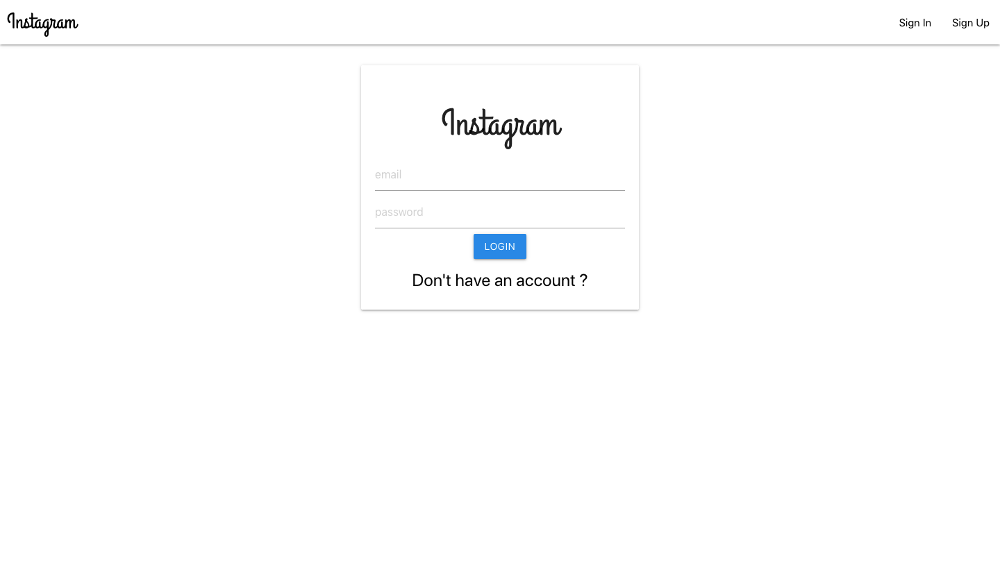
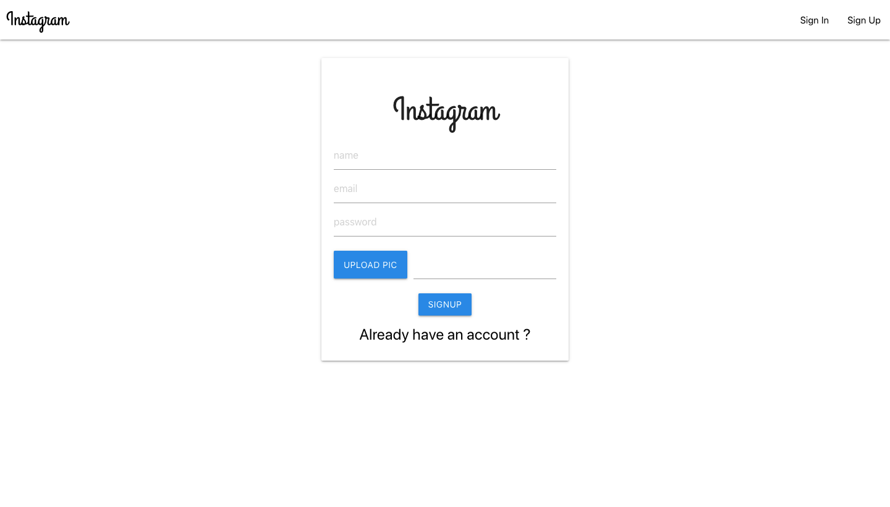
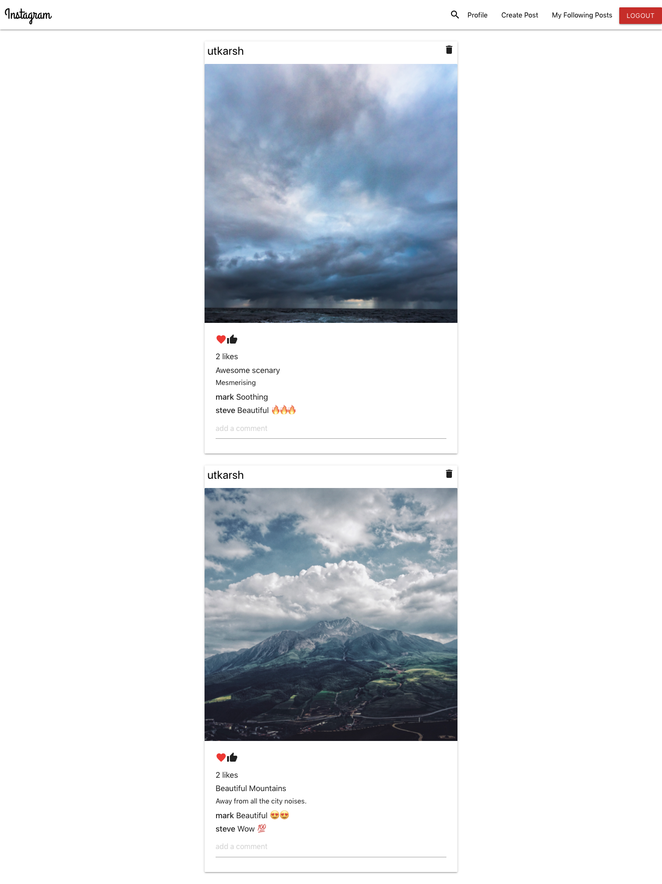
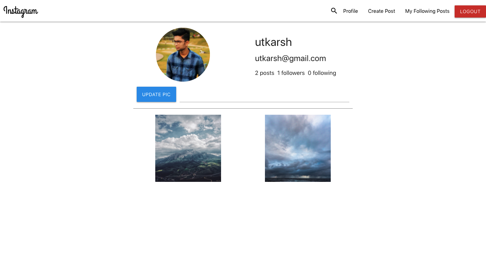
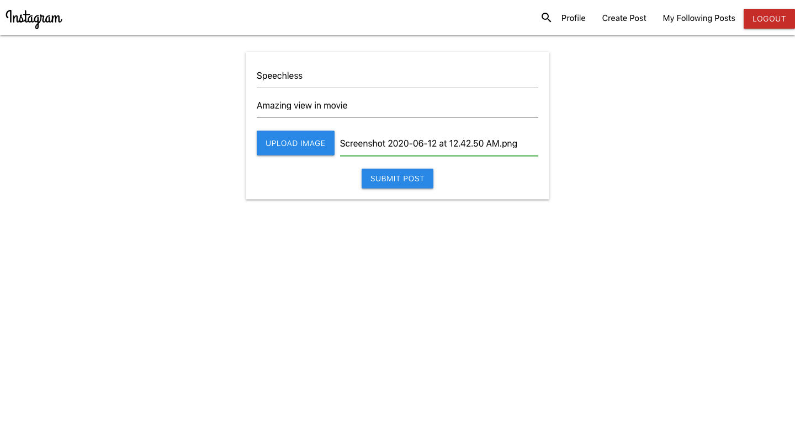
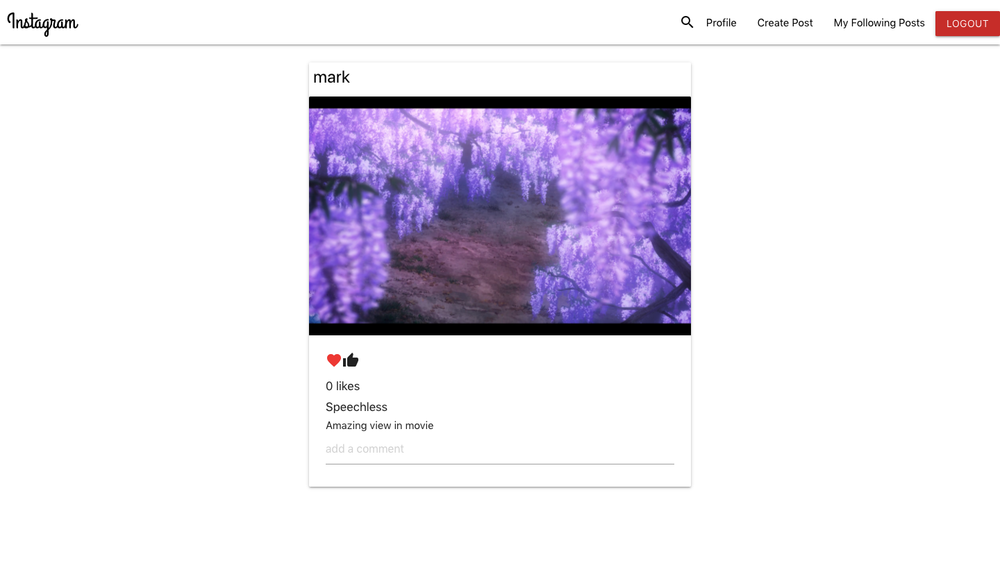
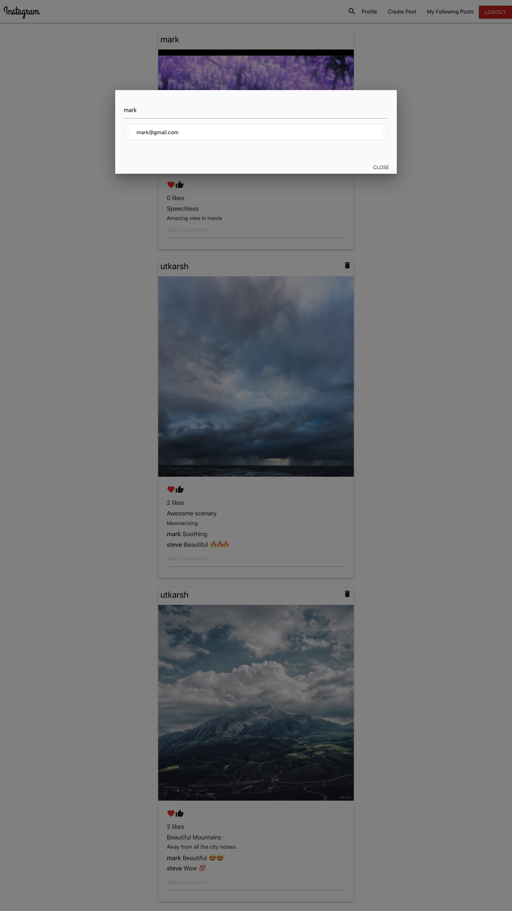
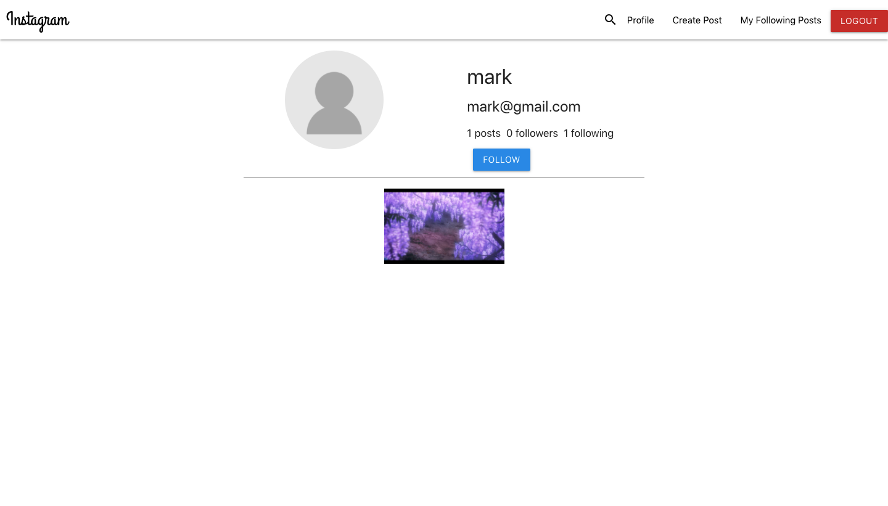

# Instagram Clone

## Welcome! 👋

Thanks for checking out this repository.
This is an Instagram clone project.
- Live Site URL: [Live site URL](https://instagram-clone-wa.herokuapp.com/)

## Table of contents

- [Overview](#overview)
  - [The challenge](#the-challenge)
  - [Screenshot](#screenshot)
- [My process](#my-process)
  - [Built with](#built-with)
  - [Useful resources](#useful-resources)

## Overview

### The challenge

- Creating database to store user's information.
- Hashing user password
- Making react components
- Creating APIs to establish communication betwee frontend and backend
- Storing pictures of user
- Routing 
- Manipulating state

### Screenshot

## My process

### Built with

- Semantic HTML5 markup
- CSS custom properties
- Materialize css
- JavaScript
- React
- MongoDB

### Useful resources

- [MDN](https://developer.mozilla.org/en-US/) - Best resource for HTML5 and CSS3.
- [Javascript(Hindi)](https://www.youtube.com/playlist?list=PLu0W_9lII9ajyk081To1Cbt2eI5913SsL) - For learning Javascript.
- [Javascript(English)](https://www.youtube.com/watch?v=PoRJizFvM7s) - For learning callbacks, Promises, Async, Await.
- [React](https://reactjs.org/) - React Documentation
- [Create React App](https://create-react-app.dev/docs/getting-started/) - Modern build setup with no configuration.
